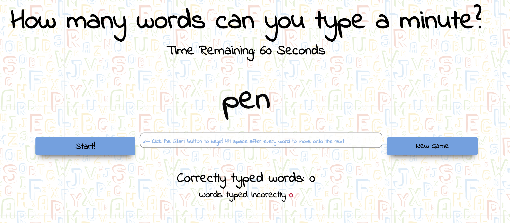
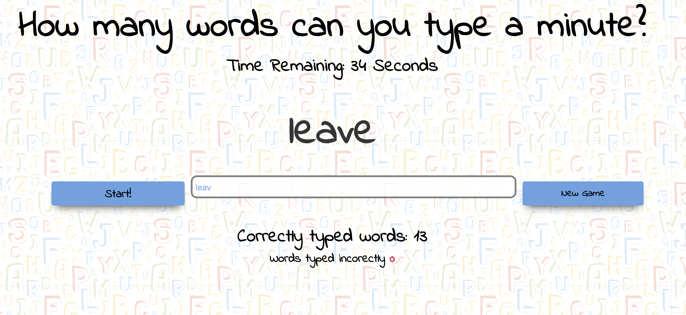
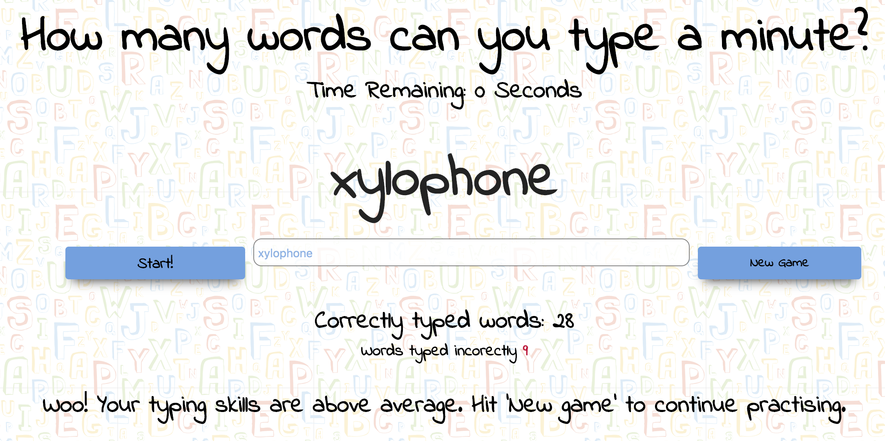

## General Assembly Project 1

### Welcome to typing practice! 

This game is designed to help track how many words the user types a minute. The user will also be notified with the number of errors they have typed. Happy typing!

####Instructions

When the user is ready, click the start button to begin. Once sthe start button has been clicked, the input bar will be automatically activated and the user can begin typing. To score points, the user has to correctly type the flashing word above the input bar and hit **SPACE** to generate the next word. But remember time is ticking! When 1 minuted is up, the user will be stoped from typing any more words.

####Technologies used

Below are a list of some the technologies I used in making the game:

* HTML5
* CSS 
* Animation
* Google Fonts
* JavaScript (ECMAScript 6)
* JQuery 
* HMLT Audio 
* Git
* GitHub

#### Screenshots

#### Developemnt 

Whilst thinking of a game to develop, I looked online for games that were fun and allowed for furhter developemnt. Out of the varying ideas, I chose the typing game bacause I felt it was the most challenging and would allow me to implement some of the skills I had learnt during my begining 3 weeks at General Assembly.

Before I began coding, I planned the layout and sturucture of the game. I initally wanted a game that was basic, simple to implement and user freindly. It was most important for me to have a game that was expandable and allowed for further developement in the future. 

What really helped was the use of pseudocode. This allowed me to flesh out any ideas I had. Hoever, when I fist began coding the game I quickly realised that some of the ideas I had were too complex to implement during the games initial development stage. These ideas have been kept in mind and will be implemented at a later stage. To facilitate those ideas, I wrote certain blocks of code that can be recalled should I require them when further developing the game. 

####Future goals

Some of the ideas that I want to include in further developemnt of the game are:

* Typing a novel as apposed to a single word
* Adding two player functionality 
* Adding a feature that allows the player to add his/her name
* Saving scores in a leaderboard using local storage
* Adding a feature that allows the user to increase the timing of a turn
* Developing a more interactive user experience with more encouriging sounds and pictures that pop up when words are typed correclty
* Adding a progress bar that fills when the user types a certain number of words in a row without making a mistake
* Proivde more detailed feeback for the user after a trun is complete. This feeback could include typing accurancy, adjustments to the postion of the hands
* In the future firebox will be added 